# GitHub Environment Setup for Terraform Pipeline

## Overview

The Terraform pipeline uses GitHub Environments with protection rules to provide manual approval directly in the pipeline UI, rather than creating separate GitHub issues.

## Setup Instructions

### 1. Create GitHub Environments

Navigate to your repository settings and create the following environments:

**Repository Settings → Environments → New Environment**

- `test` (for test environment)
- `dev` (for dev environment - future use)
- `prod` (for prod environment - future use)

### 2. Configure Protection Rules

For each environment, configure the following protection rules:

#### Required Reviewers

- ✅ Enable "Required reviewers"
- Add reviewers: `cloudspikes-inc`
- Set minimum number of reviewers: `1`

#### Optional Settings

- ⏱️ **Wait timer**: Set to `0` minutes (immediate approval available)
- 🏷️ **Deployment branches**: Limit to `main`, `develop`, and `feature/*` branches
- 🔒 **Environment secrets**: Add any environment-specific secrets if needed

### 3. How Manual Approval Works

When the Terraform pipeline runs:

1. **Automatic Steps**: Format, Init, Validate, Plan run automatically
2. **⏸️ Approval Gate**: Pipeline pauses and shows "Waiting for approval"
3. **Reviewer Action**: Reviewer goes to Actions tab → Current run → "Review deployments"
4. **Environment Selection**: Select environment(s) to approve and click "Approve and deploy"
5. **Continuation**: Pipeline continues with Apply, Output, and Results steps

### 4. Benefits of Pipeline-Based Approval

- ✅ **Native GitHub UI**: No external issues created
- ✅ **Better Context**: Approval happens directly in the pipeline run
- ✅ **Audit Trail**: All approvals logged in deployment history
- ✅ **Environment Scoped**: Different approval rules per environment
- ✅ **Branch Protection**: Can restrict deployments to specific branches

### 5. Approval Process Flow

```mermaid
graph TD
    A[PR Created] --> B[Terraform Plan]
    B --> C[Plan Comment Posted]
    C --> D[⏸️ Manual Approval Required]
    D --> E[Reviewer Approves in Pipeline UI]
    E --> F[Terraform Apply]
    F --> G[Results Comment Posted]
```



### 6. Current Configuration

- **Environment**: `test` (configured in matrix strategy)
- **Reviewers**: `cloudspikes-inc`
- **Trigger**: Pull requests affecting `infra/**` files
- **Branches**: `main`, `develop`, `feature/**`

### 7. Future Expansion

To add more environments, update the matrix strategy in the workflow:

```yaml
strategy:
    matrix:
        environment: [test, dev, prod]
```

Then create corresponding GitHub environments with appropriate protection rules.
